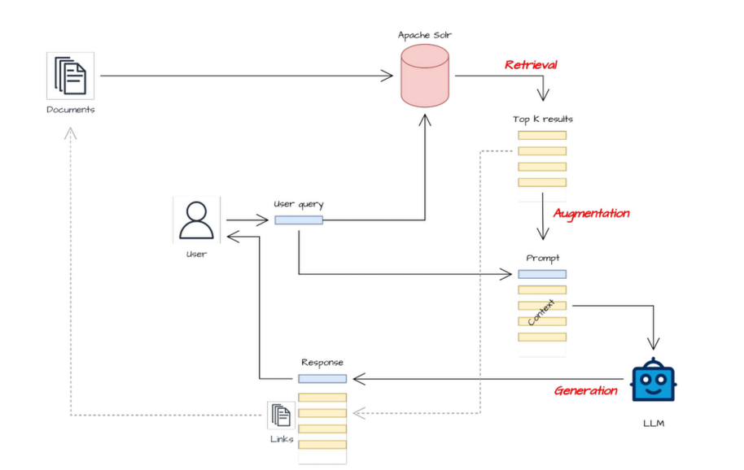

# LLMs, RAG, OpenWebUI

---

# Icebreaker Quiz questions

---

# What are LLMs?

---

## LLM: Large language models

They are basically Text-2-Text transformers.

---

# How do LLMs work?

---

## How do LLMs work?

At the very core they *just* predict the next word.

*Hamlet says: * --> LLM

*To be or not be*

---

# What LLMs do you know?

---

## What LLMs do you know?

Closed source:

- GPT3, 4, 5 (Commonly known as ChatGPT - OpenAI)
- Gemini (Google)
- Claude: Closed Source by Anthropic
- Grok: Closed Source by X

"somewhat" open source:

- Gemma: (Google)
- LLaMA 2: (Meta)
- Mistral: (Mistral AI)
- DeepSeek: (DeepSeek AI)

---

## What's OpenSource in the Context of LLMs?

The following aspects can be accessible or not per LLM:

- Code: How the LLM is build/trained
- Neuronal architecture: Design of the model - layers, connections, structure.
- Training Data: partially / fully / described
- Parameters: Weights / Biases

---

## What are the concerns when using closed source / commercial LLMs?

- Data ownership & usage
- Data security risks
- Company compliance issues
- Cost
- Vendor Lock-in
- Unknown Bias
- Transparency
- Ethical concerns
- No debugging
- No control over updates
- Ownership of outputs
- ...

---

# Do you know Ollama?

---

## Do you know Ollama?

Ollama stands for: Open LLM for All Machines

---

## Ollama demo

See

https://github.com/tran-engineering/openwebui-playground

To run it locally on your computer

---

# Do you know OpenWebUI?

---

## OpenWebUI Demo

See

https://github.com/tran-engineering/openwebui-playground

To run it locally on your computer

---

# RAG - Retrieval-Augmented Generation

---

## Motivation

We want a "customized" LLM - there are several possibilities without retraining a whole LLM:

- LoRA (low rank adaptation)
- System prompt customiziation
- RAG

---

## Why RAG at all?

The context window is the whole input to a LLM. This is typically 32-128kb. This makes it impossible to include large data (as in a big document or millions of documents).

RAG to the rescue!

Also:

Training LLMs / LoRA is expensive and time consuming, it isn't physically possible to do this reguarly (daily) for the newest information.

---

## What does RAG even do?

Enriches the input to the LLM.

This is just additional text nothing magical.

An Input for an LLM consists of:

- System prompt
- Context <-- RAG enriches the context
- User prompt

---

## Simple RAG diagram

---

## Advanced RAG diagram

---

## Components for RAG

- Document Processor: Transforms documents (pdf, markdown, excel, etc.) to Text
- Embedder: transforms text to vectors
- Vector DB: saves semantic vectors
- Retriever: finds relevant text passages
- Reranker: Sorts results by relevancy
- Generator: Writes resulting answer

---

## RAG can fail on multiple levels

---

# OpenWebUI with RAG demo